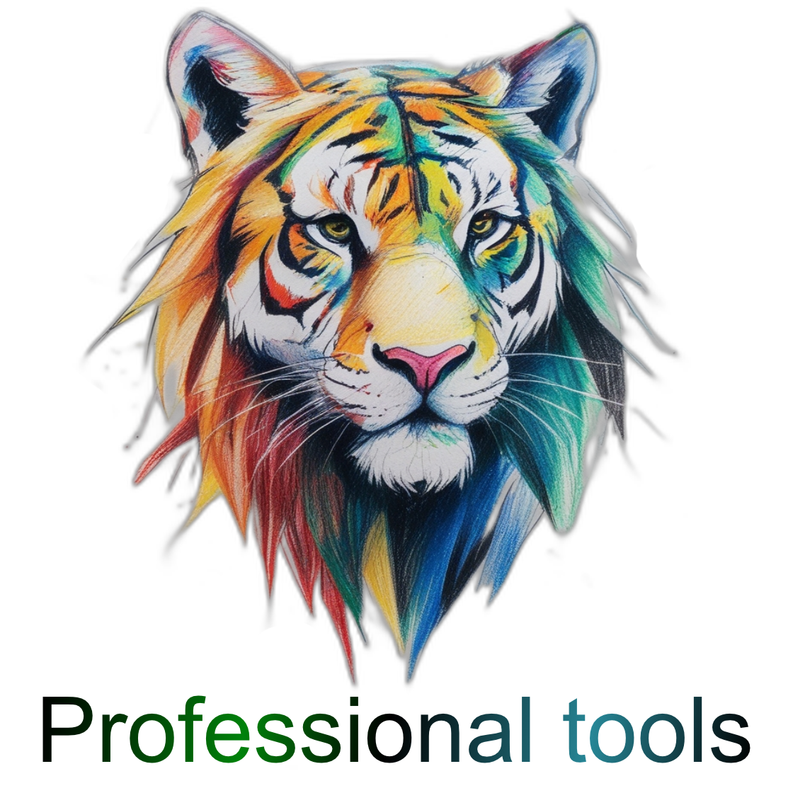

<h1 style="text-align:center; font-size:2.2em; font-weight:800; letter-spacing:1px;">
  ⚙️ SOREL HQ   Gaming Tools for Developers
</h1>

  

  
  
  

---

## 🚀 Create games with modern high-quality tools

**SOREL** = Software Operations & Reliability Engineering Lab

> Each tool is crafted for **performance**, **clarity**, and **developer happiness**.

---

## 🧰 Benefits of our tools

### 🔹 Tools & Extensions
Custom **editor utilities**, **gameplay systems**, and **workflow optimizers** tailored to your needs.  
(*Streamline your development and boost productivity.*)

### 🔹 Seamless Integration
Plug into **new or existing projects** with zero hassle.

---

## 💡 Why choose these tools?

- ✅ **Transparent & Fair Pricing** - Get professional quality for friendly prices.
- ✅ **Clean, Documented Code** - Easy to maintain, extend, and understand.
- ✅ **Developer-Centric Design** - Tools crafted by developers, for developers.
- ✅ **Optimized** - Built with performance and usability in mind across a large game spectrum.

---

  

  <em>Have ideas or requirements?   We’d like to hear from you 🙏</em>

